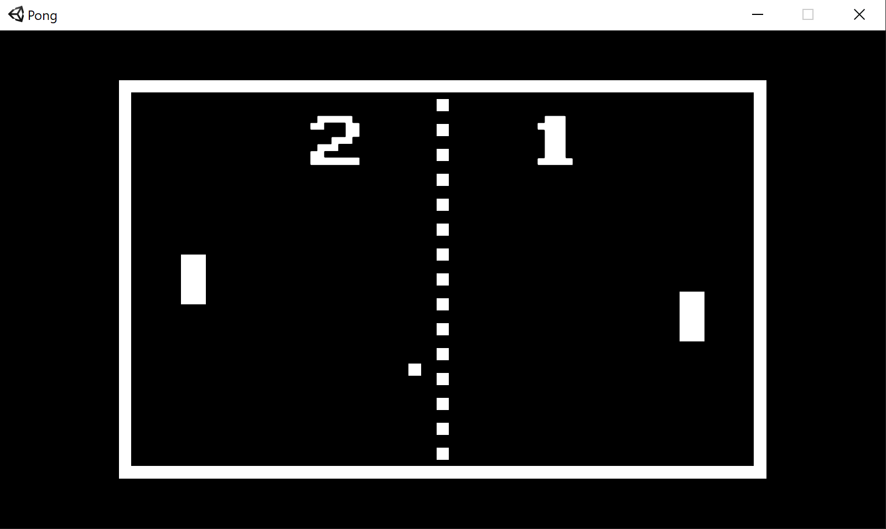

## Pong

#### A basic Pong clone in Unity

Decided to get into making games again, and most sensible advice online is to start small. Ah man, you mean I can't just jump straight in and make my own version of Rust but with skill trees like Path of Exile and a player-driven economy like EVE Online?

So here's my Pong clone. There are many like it, but this one is mine. The AI in one-player mode is not 'true' AI - actually it just periodically checks the Y position of the ball and tries to move towards it in time.

I'd tell you to have fun, but I'm not seriously expecting anyone to play it :)
